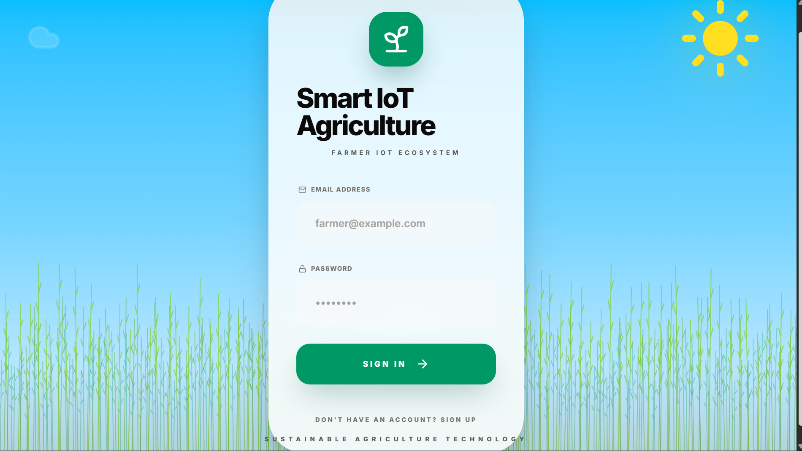
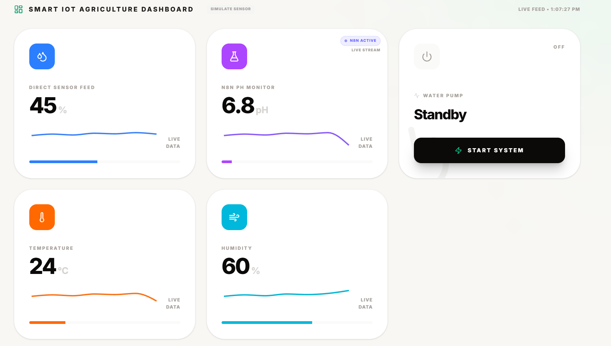
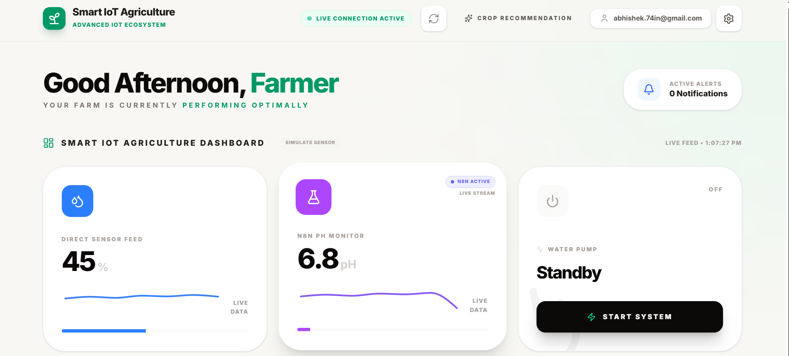
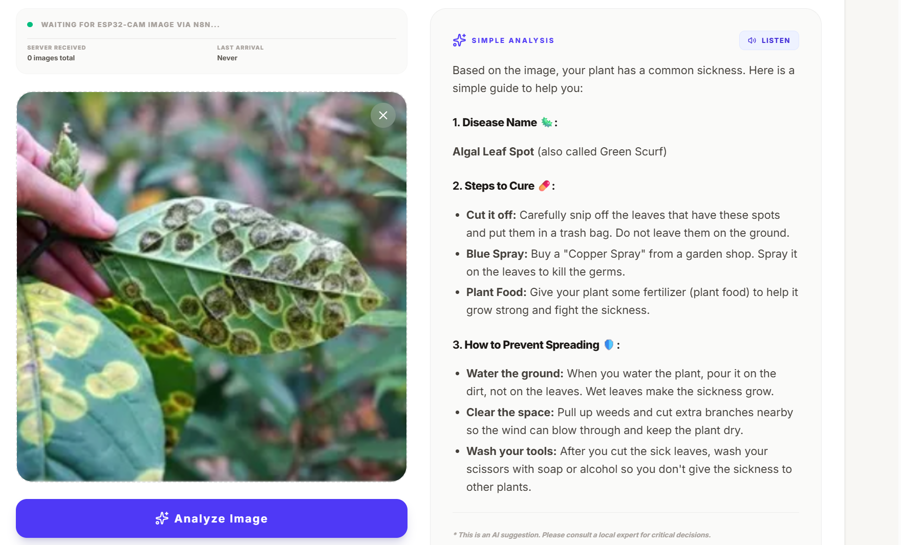

🌱 Smart Agriculture AI

🚀 AI-powered IoT system for real-time crop monitoring, disease detection, crop recommendation, and automated irrigation.

📌 Overview

Smart Agriculture AI is an intelligent IoT-based system designed to modernize farming by combining real-time sensor monitoring, image-based disease detection, and automated irrigation control.
The system integrates ESP32 devices, environmental sensors, and an AI-driven analysis engine to provide accurate insights and automatically take actions to improve crop health and productivity.

🚀 Features

* 📡 Real-time environmental monitoring
* 🌡️ Sensor integration (soil moisture, temperature, humidity, pH, water level)
* 📷 Plant disease detection using image analysis
* 🌱 Crop recommendation system
* 💧 Automated irrigation based on soil moisture levels
* 📊 Interactive dashboard visualization
* 🔐 Login system for user access
* 
💧 Automated Irrigation System
The system automatically controls water supply based on real-time soil moisture data.
⚙️ Working:

* Soil moisture sensor continuously monitors soil condition
* Data is sent via ESP32
* Server processes the data
* Irrigation pump is activated when moisture is low
* Pump is turned OFF when optimal moisture level is reached

👉 This ensures efficient water usage, reduces manual effort, and prevents over-irrigation.
 🛠 Tech Stack

* **Hardware:** ESP32, ESP32-CAM
* **Frontend:** HTML, CSS, JavaScript
* **Backend:** Node.js
* **Automation:** n8n
* **AI Engine:** Custom analysis system
  
🧠 System Architecture
Sensors → ESP32 → Data Transmission → Server → AI Analysis → Irrigation Control → Dashboard Output⚙️ How to Run

1. Clone the repository
   git clone https://github.com/Abhi55-07/Smart-Ai-agri.git
2. Navigate to project folder
   cd Smart-Ai-agri
3. Install dependencies
   npm install
4. Start the server
   npm run dev
5. Open in browser
   http://localhost:3000
   
## 📸 Screenshots

 🔐 Login Page

 📊 Dashboard

 📊 Dashboard View 2

🌱 Crop Recommendation

🦠 Disease Analysis

 📂 Project Structure
Smart-Ai-agri/
│── src/
│── images/
│   ├── dashboard.png
│   ├── dashboard1.png
│   ├── login.png
│   ├── crop recommendation.png
│   ├── plant disease analysis.png
│── index.html
│── server.ts
│── package.json
│── package-lock.json
│── metadata.json
│── vite.config.ts
│── tsconfig.json
│── .gitignore
│── README.md

🔮 Future Scope

* 📱 Mobile application integration
* ☁️ Cloud-based analytics and storage
* 🧠 Advanced AI-based disease prediction
* 🤖 Fully autonomous smart farming system

 📜 License

© 2026 Abhishek Gupta. All Rights Reserved.
This project is proprietary and may not be copied, modified, or distributed without permission.

 👨‍💻 Author

Abhishek Gupta
🎓 CSE Student at KIIT
📧 [abhishek.74in@gmail.com](mail to :abhishek.74in@gmail.com)

---

